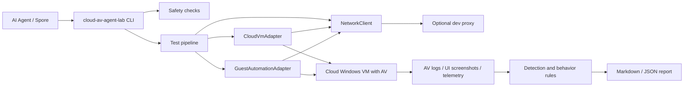
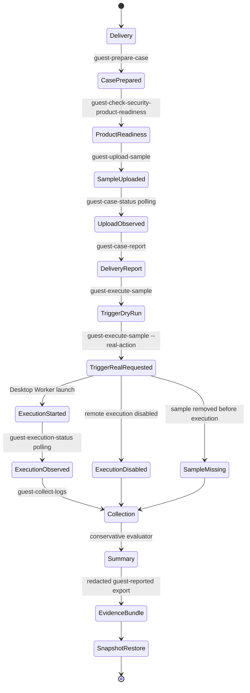

# Architecture

Cloud AV Agent Lab is a local control plane. It plans and records work, while every risky operation happens in a cloud-isolated guest.

## Components

## Four-Stage Flow

The project separates delivery, trigger, execution observation, and evaluation
so the control plane can be tested without mixing upload status, process launch,
process facts, and AV verdict logic.

Delivery is the current safe upload and observation path. The server prepares a
case workspace, saves only the user-supplied EICAR or harmless file plus
metadata, and updates `case_state.json`, `events.jsonl`, and `case_report.json`.
The upload endpoint returns immediately after writing the file; follow-up
status calls perform live `Path.exists` / `Path.stat` checks so delayed AV
removal can be observed without holding the upload request open.

Trigger is a controlled case action, not a general command runner. The default
CLI request is `dry_run_execute_uploaded_sample`, which validates metadata and
path ownership without launching a process. A real trigger requires local
`[guest_agent.execution].enabled = true`, a matching execution token, and a
cloud agent started with `--enable-execution-actions`. The server resolves the
file from `sample.json`, rejects arbitrary paths or shell arguments, verifies
that the file is still under `<workdir>\cases\<case_id>\sample\`, signs a
short-lived execution lease, and forwards the action to Desktop Worker. Worker
derives the sample path from shared metadata and starts it with
`subprocess.Popen([sample_path], cwd=sample_dir, shell=False)`.

Execution observation is read-only and low-intrusion. The Agent observes only
the root PID recorded for the current case and its descendants, takes short
metadata snapshots, does not cache process objects, does not accept arbitrary
PIDs, and does not infer AV blocking from process disappearance alone.

Collection and evaluation are intentionally separate. Collectors read
product-specific logs after the trigger phase, the evaluator produces a
conservative verdict, and the exporter writes a redacted guest-reported evidence
bundle before the Lighthouse baseline snapshot is restored. Defender or
vendor-log parsing should not be coupled into upload or trigger endpoints.

Security product readiness is a separate case-scoped pre-delivery observation
stage. The first MVP supports Huorong log observability and writes
`case_security_product_readiness.json`, `case_state.security_product_readiness`,
and a `case_report.json` summary. It is read-only: it checks the product log
directory, copies `log.db` into the case readiness snapshot directory, and reads
copied-file metadata. It does not parse interception logs, does not read sample
bytes, does not modify product services, and does not prove real-time
protection is enabled. The evaluator uses readiness only to gate the optimistic
`no_detection_observed` verdict: `ready` is required before claiming no
detection was observed, while explicit product-log detections still win. The
evidence exporter may include only the redacted
`case_security_product_readiness.json` metadata; the copied readiness snapshot
directory is raw product log material and remains excluded. Collection remains
responsible for product-log detection evidence.

## Adapter Contracts

`CloudVmAdapter` owns infrastructure actions:

- restore baseline snapshot;
- start and stop VM;
- reboot VM;
- query instance status;
- capture VM screenshot;
- enforce network profile.

`GuestAutomationAdapter` owns guest actions:

- prepare per-case workspace inside the guest;
- upload or stage the user-explicit EICAR/harmless sample into a guest case
  workspace;
- request only bounded case actions for registered uploads;
- collect product logs and behavior observations.

HTTP access to a cloud-side Guest Agent uses `GuestAgentClient`, which
delegates outbound requests to `NetworkClient`.

The null/default adapters are plan-only and never execute a sample.

## Single-Run Orchestration

`single-run` is the first user-facing orchestration layer. It does not replace
the adapter contracts; it composes them for one case:

1. create a run id, case id, run directory, contextual logger, and instance lock;
2. generate a non-sensitive `lab.generated.toml`;
3. restore the Lighthouse baseline and wait for a stable running guest;
4. wait for Guest Agent health twice, then require Desktop Worker ready for
   real runs before applying a settling cooldown;
5. prepare the case, run security product readiness in warning-only mode,
   upload the explicit EICAR/harmless file, observe upload state, optionally
   request the controlled action, collect logs, summarize, and export evidence;
6. export evidence before cleanup, then restore the baseline again;
7. if cleanup restore fails, attempt the same guarded `stop_vm` path as
   emergency poweroff and record the result in `run_state.json`.

The lock is local and keyed by resolved `instance_id`, preventing two runs from
restoring or testing the same Lighthouse instance at the same time. The generated
config never contains tokens or cloud secrets; credentials and Guest Agent tokens
remain environment-variable only. Because `single-run` is the ordinary-user
entrypoint, it defaults to a real run and asks for one runtime risk
confirmation before touching the instance. The user-entered instance id and
snapshot id are then used as the internal adapter confirmations. Passing
`--dry-run` switches the generated cloud profile back to `mock`/`dry_run` and
keeps the controlled action in dry-run mode.

Desktop Worker is the execution-layer split for Windows desktop-session
correctness. The Worker runs in the interactive desktop session and is queried
through Control Agent `/worker/status`; it binds only to localhost and is
authenticated with `CLOUD_AV_DESKTOP_WORKER_TOKEN`. Current real process launch
and process-tree observation are routed through Worker with a short-lived
single-use execution lease, run-bound metadata, `.exe`-only enforcement, and
minimal child-process environment. See `docs/DESKTOP_WORKER.md`.

The Guest Agent MVP is documented in `docs/GUEST_AGENT.md`. It currently covers
`/health`, `/system-info`, `/prepare-case`, an EICAR/harmless-file upload
endpoint, metadata-derived case status/report/summary endpoints, a redacted
guest-reported evidence endpoint, product log collection endpoints, Worker
status proxy, and a default-disabled
controlled action endpoint. The default workflow does not execute samples; the
real trigger path is available only when execution is explicitly enabled,
Desktop Worker is ready, and the request is restricted to the current case's
registered uploaded EICAR or harmless `.exe`.

The trigger-stage design is documented in `docs/EXECUTION_MODEL.md`. It forbids
arbitrary command execution, client-supplied guest paths, shell/cmd/PowerShell
arguments, and direct Defender-log coupling in the trigger stage. Trigger
actions must be based only on current case metadata and the registered uploaded
sample. The current real trigger path is default-off and requires a separate
execution token plus Desktop Worker lease; when enabled for cloud-side manual
validation, Worker starts only the registered uploaded file with `shell=False`
and Control Agent records the PID and Worker observation in case state.

Evaluation and export are separate layers after collection. Collectors only copy
and normalize product evidence into the case workspace. The evaluator combines
delivery, execution, readiness, and collection evidence into a conservative
`case_summary.json`; `no_detection_observed` is gated on stable delivery,
observed execution, a successful collection window, zero matching evidence, and
`security_product_readiness.state == ready`. Missing or partial collection,
missing or non-ready readiness, Worker/lease/sha mismatch states, and process
disappearance without product-log evidence remain `inconclusive` or
`execution_not_observed`.

Evidence export uses the v2 redacted text artifact model. Once a sample has
been delivered or triggered, the test guest workspace, Guest Agent, Desktop
Worker, interpreter, tools, static files, copied logs, and temporary
directories are treated as untrusted guest-reported observations. The default
bundle includes only redacted text-format artifacts such as case metadata,
`case_security_product_readiness.json`, `sample/sample.json`, Worker state JSON,
summaries, events, and normalized evidence. It excludes uploaded sample bytes,
recursive zip files, real cloud configs, token-like files, symlinks, junctions,
unknown roots, `security-product-readiness/` readiness snapshots, raw
SQLite/WAL/SHM logs, executables, DLLs, and other unredacted binary product
artifacts. The
manifest records included/excluded paths, redaction policy, redacted files,
`trust_model=dirty_instance_untrusted`, `forensic_grade=false`,
`raw_binary_included=false`, and SHA-256 hashes for audit.

Raw product logs are not part of the normal evidence bundle. If a later phase
requires forensic-grade raw evidence, the trust root should move to an offline
workflow: stop the test instance, clone or snapshot the disk, mount it read-only
in a clean forensic environment, run a trusted collector/redactor there, and
export redacted text artifacts from that environment.

`VmProfile` represents a recoverable test environment profile, not necessarily a unique cloud machine. Multiple profiles may share the same Lighthouse `instance_id` when each profile points to a different `baseline_snapshot` and `product_id`. This single-instance, multi-snapshot layout is supported as long as orchestration remains serial or future schedulers lock by `instance_id`.

## Tencent Cloud Lighthouse Adapter

`TencentCloudLighthouseAdapter` is the first cloud adapter. The public import remains `cloud_av_agent_lab.adapters.tencent_cloud`, which is now a small facade. The implementation lives under `cloud_av_agent_lab.adapters.tencent_lighthouse`, with separate modules for auth loading, TC3 signing, response parsing, status models, errors, and adapter lifecycle logic. Real Tencent Cloud API integration remains behind one `_call_api()` method on the adapter.

The adapter has two modes:

- `mock`: returns a `VMOperationResponse` without network access.
- `real`: prepares real Tencent Cloud actions. With `dry_run = true`, every action is intercepted and rendered as `[DRY-RUN] Would call: ...`.

Credential loading follows environment variables first, then TOML config:

- `TENCENTCLOUD_SECRET_ID`
- `TENCENTCLOUD_SECRET_KEY`
- `TENCENTCLOUD_REGION`
- `TENCENTCLOUD_INSTANCE_ID` or `TENCENTCLOUD_INSTANCE_ID_<VM_ID_SUFFIX>`

The adapter now signs API 3.0 requests with TC3-HMAC-SHA256 and sends them through `NetworkClient`. Remaining production work is to expand action coverage, add polling, and harden provider-specific error handling.

`DescribeInstances` responses are normalized into `LighthouseInstanceStatus` before higher-level workflows consume them. The raw Tencent Cloud `Response` remains available, while `response.data["InstanceStatus"]` provides the stable fields and conservative readiness checks used by future polling, Guest Agent access, and write-operation preflight guards.

The readiness checks intentionally fail closed: unknown Lighthouse states, restricted instances, or in-progress latest operations block follow-up automation until a later poll returns a stable state.

Lifecycle writes are intentionally gated twice. The CLI only permits `cloud-start`, `cloud-stop`, and `cloud-reboot` to execute when the config is `mode = "real"`, `dry_run = false`, and the operator supplies `--confirm-instance` matching the resolved Lighthouse instance id. Otherwise the command is forced through the dry-run path. After a real write is accepted, the adapter polls `DescribeInstances` until the target state is reached or `LatestOperationState` reports `FAILED`.

Snapshot restore uses the same write gate plus `--confirm-snapshot`, which must match the configured VM `baseline_snapshot`. Before `ApplyInstanceSnapshot`, the adapter performs a `DescribeInstances` preflight and fails closed unless the instance is `STOPPED` with a stable control-plane state. After restore, it waits for the restore operation to settle and starts the instance if Lighthouse leaves it stopped, ending only when the instance is stable `RUNNING`.

Lifecycle commands configure INFO logging for operator visibility. The adapter emits a one-line API acceptance message with the Tencent Cloud `RequestId`, then emits one polling line per `DescribeInstances` query with instance state, latest operation state, and elapsed wait time.

## Temporary Proxy Layer

The `[network.proxy]` table is a development-only bridge for local control-plane access when cloud hosts or APIs are not reachable from the developer network. It is optional and disabled by default.

All outbound cloud API or Guest Agent requests should go through `NetworkClient`. Business code should not read proxy settings directly. With `enabled = false`, the proxy map is empty and behavior is equivalent to direct networking. For formal delivery, the team can leave it disabled or remove the proxy module and config table without changing the test pipeline contract.

The proxy layer does not alter the sample boundary: samples remain cloud object references and are only fetched inside the isolated guest.
