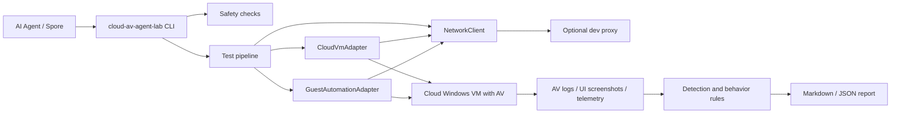

# Architecture

Cloud AV Agent Lab is a local control plane. It plans and records work, while every risky operation happens in a cloud-isolated guest.

## Components

## Execution Phases

1. Validate configuration and reject local sample paths.
2. Build the sample x AV product test matrix.
3. Restore the target VM to its clean snapshot.
4. Start the VM inside an isolated cloud network.
5. Ask the guest adapter to fetch the sample directly from cloud object storage.
6. Run the approved test command inside the guest and wait for bounded completion.
7. Collect logs, screenshots, and behavior observations from the guest.
8. Parse AV signals and behavior signals.
9. Restore the clean snapshot again.
10. Generate a structured report.

## Adapter Contracts

`CloudVmAdapter` owns infrastructure actions:

- restore baseline snapshot;
- start and stop VM;
- reboot VM;
- query instance status;
- capture VM screenshot;
- enforce network profile.

`GuestAutomationAdapter` owns guest actions:

- prepare per-case workspace inside the guest;
- stage sample from cloud object storage to the guest;
- execute the sample under time limits;
- collect product logs and behavior observations.

Future HTTP access to a cloud-side Guest Agent should use `GuestAgentClient`,
which delegates outbound requests to `NetworkClient`.

The default adapters are plan-only and never execute a sample.

## Tencent Cloud Lighthouse Adapter

`TencentCloudLighthouseAdapter` is the first cloud adapter. It reserves methods for Lighthouse lifecycle operations and keeps real Tencent Cloud API integration behind one `_call_api()` method.

The adapter has two modes:

- `mock`: returns a `VMOperationResponse` without network access.
- `real`: prepares real Tencent Cloud actions. With `dry_run = true`, every action is intercepted and rendered as `[DRY-RUN] Would call: ...`.

Credential loading follows environment variables first, then TOML config:

- `TENCENTCLOUD_SECRET_ID`
- `TENCENTCLOUD_SECRET_KEY`
- `TENCENTCLOUD_REGION`
- `TENCENTCLOUD_INSTANCE_ID` or `TENCENTCLOUD_INSTANCE_ID_<VM_ID_SUFFIX>`

The adapter now signs API 3.0 requests with TC3-HMAC-SHA256 and sends them through `NetworkClient`. Remaining production work is to expand action coverage, add polling, and harden provider-specific error handling.

`DescribeInstances` responses are normalized into `LighthouseInstanceStatus` before higher-level workflows consume them. The raw Tencent Cloud `Response` remains available, while `response.data["InstanceStatus"]` provides the stable fields and conservative readiness checks used by future polling, Guest Agent access, and write-operation preflight guards.

The readiness checks intentionally fail closed: unknown Lighthouse states, restricted instances, or in-progress latest operations block follow-up automation until a later poll returns a stable state.

Lifecycle writes are intentionally gated twice. The CLI only permits `cloud-start`, `cloud-stop`, and `cloud-reboot` to execute when the config is `mode = "real"`, `dry_run = false`, and the operator supplies `--confirm-instance` matching the resolved Lighthouse instance id. Otherwise the command is forced through the dry-run path. After a real write is accepted, the adapter polls `DescribeInstances` until the target state is reached or `LatestOperationState` reports `FAILED`.

Lifecycle commands configure INFO logging for operator visibility. The adapter emits a one-line API acceptance message with the Tencent Cloud `RequestId`, then emits one polling line per `DescribeInstances` query with instance state, latest operation state, and elapsed wait time.

## Temporary Proxy Layer

The `[network.proxy]` table is a development-only bridge for local control-plane access when cloud hosts or APIs are not reachable from the developer network. It is optional and disabled by default.

All outbound cloud API or Guest Agent requests should go through `NetworkClient`. Business code should not read proxy settings directly. With `enabled = false`, the proxy map is empty and behavior is equivalent to direct networking. For formal delivery, the team can leave it disabled or remove the proxy module and config table without changing the test pipeline contract.

The proxy layer does not alter the sample boundary: samples remain cloud object references and are only fetched inside the isolated guest.
