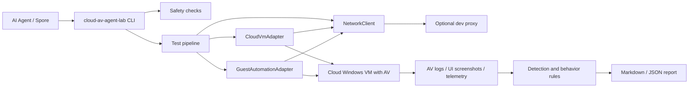
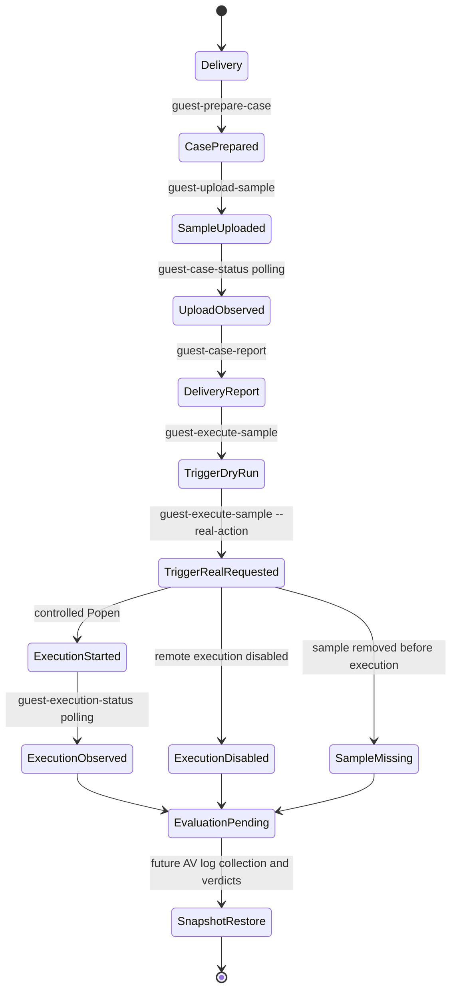

# Architecture

Cloud AV Agent Lab is a local control plane. It plans and records work, while every risky operation happens in a cloud-isolated guest.

## Components

## Four-Stage Flow

The project separates delivery, trigger, execution observation, and evaluation
so the control plane can be tested without mixing upload status, process launch,
process facts, and AV verdict logic.

Delivery is the current safe upload and observation path. The server prepares a
case workspace, saves only the user-supplied EICAR or harmless file plus
metadata, and updates `case_state.json`, `events.jsonl`, and `case_report.json`.
The upload endpoint returns immediately after writing the file; follow-up
status calls perform live `Path.exists` / `Path.stat` checks so delayed AV
removal can be observed without holding the upload request open.

Trigger is a controlled case action, not a general command runner. The default
CLI request is `dry_run_execute_uploaded_sample`, which validates metadata and
path ownership without launching a process. A real trigger requires local
`[guest_agent.execution].enabled = true`, a matching execution token, and a
cloud agent started with `--enable-execution-actions`. The server resolves the
file from `sample.json`, rejects arbitrary paths or shell arguments, verifies
that the file is still under `<workdir>\cases\<case_id>\sample\`, and starts it
with `subprocess.Popen([sample_path], cwd=sample_dir, shell=False)`.

Execution observation is read-only and low-intrusion. The Agent observes only
the root PID recorded for the current case and its descendants, takes short
metadata snapshots, does not cache process objects, does not accept arbitrary
PIDs, and does not infer AV blocking from process disappearance alone.

Evaluation is intentionally separate. Future work should read AV logs,
screenshots, and product-specific telemetry after the trigger phase, produce a
verdict, then restore the Lighthouse baseline snapshot. Defender or vendor-log
parsing should not be coupled into upload or trigger endpoints.

## Adapter Contracts

`CloudVmAdapter` owns infrastructure actions:

- restore baseline snapshot;
- start and stop VM;
- reboot VM;
- query instance status;
- capture VM screenshot;
- enforce network profile.

`GuestAutomationAdapter` owns guest actions:

- prepare per-case workspace inside the guest;
- stage sample from cloud object storage to the guest;
- execute the sample under time limits;
- collect product logs and behavior observations.

Future HTTP access to a cloud-side Guest Agent should use `GuestAgentClient`,
which delegates outbound requests to `NetworkClient`.

The default adapters are plan-only and never execute a sample.

The Guest Agent MVP is documented in `docs/GUEST_AGENT.md`. It currently covers
only `/health`, `/system-info`, `/prepare-case`, an EICAR/harmless-file upload
endpoint, metadata-only case status/report endpoints, and a default-disabled
controlled action endpoint. The default workflow does not execute samples; the
real trigger path is available only when execution is explicitly enabled and is
restricted to the current case's registered uploaded EICAR or harmless file.

The trigger-stage design is documented in `docs/EXECUTION_MODEL.md`. It forbids
arbitrary command execution, client-supplied guest paths, shell/cmd/PowerShell
arguments, and direct Defender-log coupling in the trigger stage. Trigger
actions must be based only on current case metadata and the registered uploaded
sample. The current real trigger path is default-off and requires a separate
execution token; when enabled for cloud-side manual validation, it starts only
the registered uploaded file with `shell=False` and records the PID in case
state.

`VmProfile` represents a recoverable test environment profile, not necessarily a unique cloud machine. Multiple profiles may share the same Lighthouse `instance_id` when each profile points to a different `baseline_snapshot` and `product_id`. This single-instance, multi-snapshot layout is supported as long as orchestration remains serial or future schedulers lock by `instance_id`.

## Tencent Cloud Lighthouse Adapter

`TencentCloudLighthouseAdapter` is the first cloud adapter. It reserves methods for Lighthouse lifecycle operations and keeps real Tencent Cloud API integration behind one `_call_api()` method.

The adapter has two modes:

- `mock`: returns a `VMOperationResponse` without network access.
- `real`: prepares real Tencent Cloud actions. With `dry_run = true`, every action is intercepted and rendered as `[DRY-RUN] Would call: ...`.

Credential loading follows environment variables first, then TOML config:

- `TENCENTCLOUD_SECRET_ID`
- `TENCENTCLOUD_SECRET_KEY`
- `TENCENTCLOUD_REGION`
- `TENCENTCLOUD_INSTANCE_ID` or `TENCENTCLOUD_INSTANCE_ID_<VM_ID_SUFFIX>`

The adapter now signs API 3.0 requests with TC3-HMAC-SHA256 and sends them through `NetworkClient`. Remaining production work is to expand action coverage, add polling, and harden provider-specific error handling.

`DescribeInstances` responses are normalized into `LighthouseInstanceStatus` before higher-level workflows consume them. The raw Tencent Cloud `Response` remains available, while `response.data["InstanceStatus"]` provides the stable fields and conservative readiness checks used by future polling, Guest Agent access, and write-operation preflight guards.

The readiness checks intentionally fail closed: unknown Lighthouse states, restricted instances, or in-progress latest operations block follow-up automation until a later poll returns a stable state.

Lifecycle writes are intentionally gated twice. The CLI only permits `cloud-start`, `cloud-stop`, and `cloud-reboot` to execute when the config is `mode = "real"`, `dry_run = false`, and the operator supplies `--confirm-instance` matching the resolved Lighthouse instance id. Otherwise the command is forced through the dry-run path. After a real write is accepted, the adapter polls `DescribeInstances` until the target state is reached or `LatestOperationState` reports `FAILED`.

Snapshot restore uses the same write gate plus `--confirm-snapshot`, which must match the configured VM `baseline_snapshot`. Before `ApplyInstanceSnapshot`, the adapter performs a `DescribeInstances` preflight and fails closed unless the instance is `STOPPED` with a stable control-plane state. After restore, it waits for the restore operation to settle and starts the instance if Lighthouse leaves it stopped, ending only when the instance is stable `RUNNING`.

Lifecycle commands configure INFO logging for operator visibility. The adapter emits a one-line API acceptance message with the Tencent Cloud `RequestId`, then emits one polling line per `DescribeInstances` query with instance state, latest operation state, and elapsed wait time.

## Temporary Proxy Layer

The `[network.proxy]` table is a development-only bridge for local control-plane access when cloud hosts or APIs are not reachable from the developer network. It is optional and disabled by default.

All outbound cloud API or Guest Agent requests should go through `NetworkClient`. Business code should not read proxy settings directly. With `enabled = false`, the proxy map is empty and behavior is equivalent to direct networking. For formal delivery, the team can leave it disabled or remove the proxy module and config table without changing the test pipeline contract.

The proxy layer does not alter the sample boundary: samples remain cloud object references and are only fetched inside the isolated guest.
